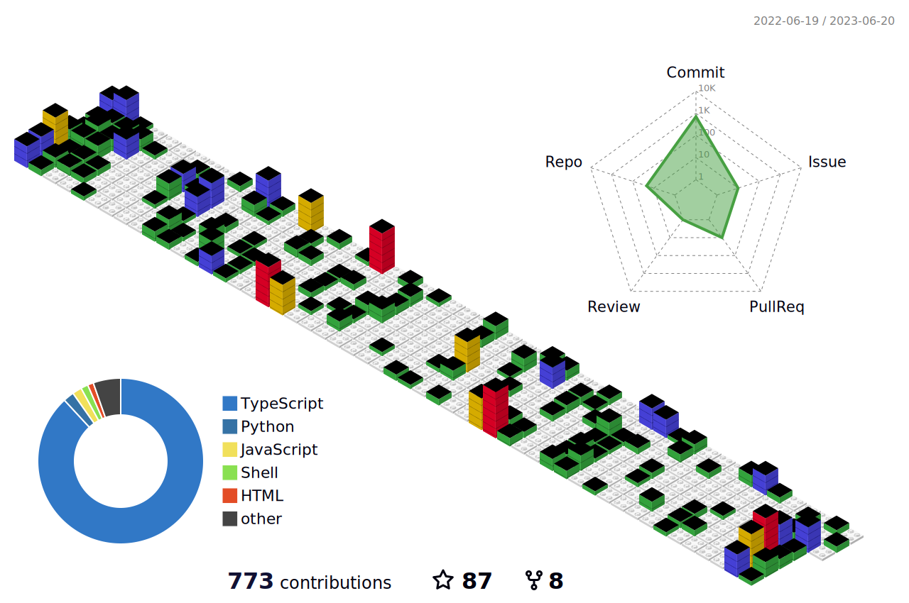

# Hi, I'm Shubham Patil 👨‍💻

I'm currently a high school student (which takes away _too_ much time), and I like to code as a fullstack web developer ("making the next unicorn 🦄 startup | ycombinator batch of S42 | to the moon 🚀 | backed by twenty venture capitalists | based in silicon valley" ™) in my free time.

I use a lot of Javascript and Typescript (I don't know if this is necessarily good or not). TailwindCSS is a great library. I mainly use Python for automation scripts :)  

Fun fact: My first plane ride was when I was 4 months old 🛫

Here are some of the things I have:

- [A website](https://shubhampatil.dev) (you can literally find most of this information there)
- [A blog](https://dev.to/shubhampatilsd/)
- [A Twitter thing](https://twitter.com/ShubhamPatilsd)
- [A LinkedIn](https://www.linkedin.com/in/shubham-patil-5352a3215/)
- [A YouTube channel](https://www.youtube.com/channel/UCExbrmSa1r97Q3AUNvkpdnQ) (I only posted here once)

<!-- Favorite Tools:
- Editor: VSCode 
- Operating System: Linux 🐧
- Keyboard: Keychron K2 (the switches go thock thock thock without any modifications which is cool)
- Mouse: I really could care less. If it moves my pointer I'm cool with it 😎 🐭
- Monitor: Ultrawide (don't really care about the model, if it has a 21:9 aspect ratio I'm cool with it)
- Typescript
- Frontend 🕸️
    - NextJS
    - TailwindCSS
- Backend 👨‍🔧
    - Node.js
    - Express
    - Prisma -->
<!-- 
     

Ooh Lego bricks -->
